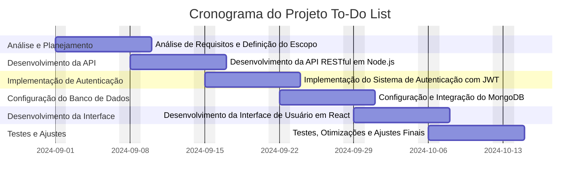
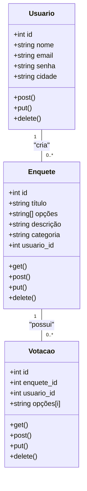
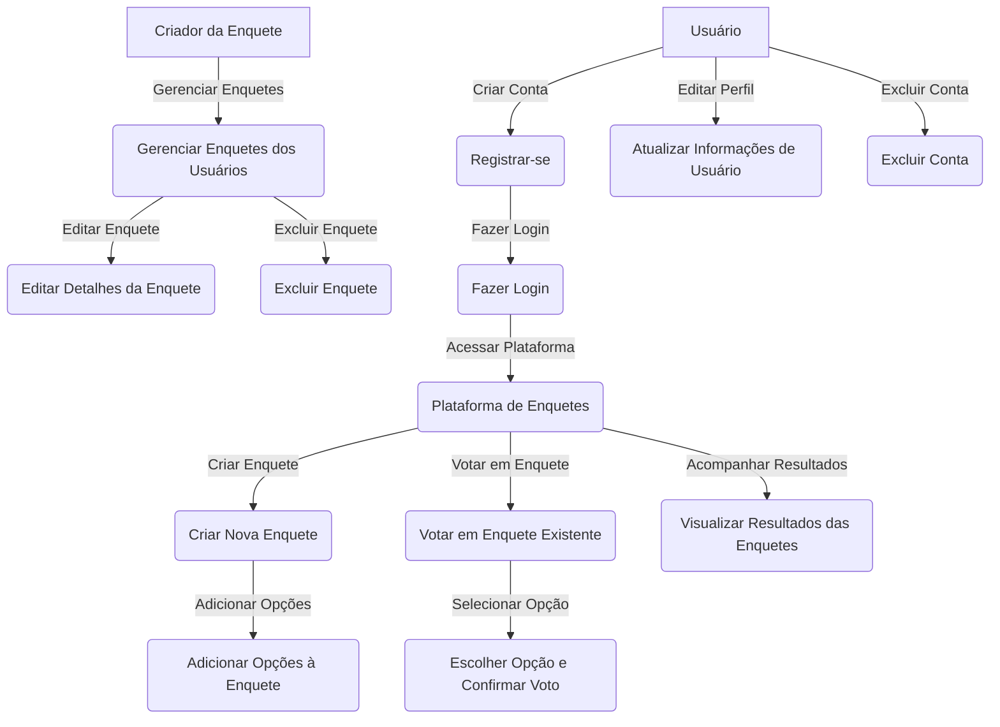
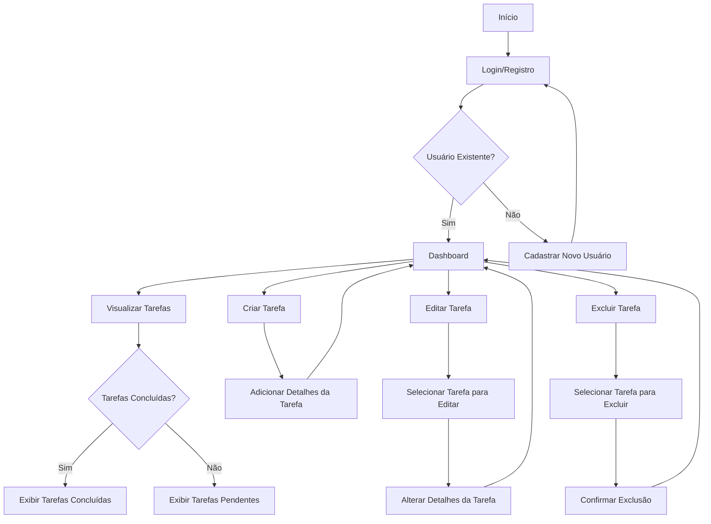

 
 
 

   

   
  
  
  

 
   

</a>

## Apresentação do Projeto: Desenvolvimento de Aplicação sobre Plataforma de Enquetes Interativas

### Visão Geral do Projeto
**Objetivo:**
Desenvolver uma aplicação web sobre uma plataforma interativa de enquetes, na qual os usuários poderão criar, votar e acompanhar os resultados. Nós utilizaremos tecnologias modernas e práticas de mercado, garantindo segurança, escalabilidade e uma experiência de usuário fluida por meio do React, Next, Node.js, MongoDB, e JWT, criando uma aplicação completa e funcional que pode ser utilizada no mundo real.

**Por Que Este Projeto?**
A nossa empresa, dedicada a inovar no campo da interação digital, está em processo de criação de uma plataforma de enquetes interativas. Esse projeto visa proporcionar uma experiência envolvente e dinâmica para os usuários, permitindo que eles participem e criem enquetes de maneira intuitiva e interativa. Com o objetivo de transformar a forma como as pessoas coletam e analisam opiniões, precisamos de uma solução tecnológica avançada que ofereça uma interface amigável e funcionalidades robustas. 
     
</a>

A plataforma de enquetes será desenvolvida utilizando Node.js para o backend e React e Next.js para o frontend, com MongoDB como banco de dados e JWT para autenticação. A solução visa proporcionar uma experiência de usuário intuitiva, com recursos para criação, visualização, atualização e exclusão de enquetes.
     

</a>

- **Específicos:**
  1. Criar uma API RESTful com Node.js que suporte operações CRUD (Criar, Ler, Atualizar, Deletar) para enquetes, até o final da segunda semana.
  2. Implementar um sistema de autenticação de usuários utilizando JWT até o final da terceira semana.
  3. Configurar e integrar o banco de dados MongoDB, permitindo o armazenamento seguro e eficiente das enquetes dos usuários, até o final da quarta semana.
  4. Desenvolver a interface de usuário em React e Next, permitindo a criação e gerenciamento de enquetes, até o final da quinta semana.

- **Mensuráveis:**
  1. Alcançar uma base de 100 usuários registrados na plataforma dentro do primeiro mês após o lançamento.
  2. Garantir que 90% das operações CRUD sejam concluídas com sucesso e sem erros no primeiro mês de operação.
  3. Obter uma avaliação de satisfação do usuário de pelo menos 4,5 em uma escala de 1 a 5 após o segundo mês de uso da plataforma.
  4. Assegurar que a aplicação suporte pelo menos 500 acessos simultâneos sem degradação de performance.
      

</a>

     

</a>

1. **Atrasos no Desenvolvimento:** O tempo limitado pode levar a atrasos na entrega das funcionalidades, impactando o cronograma geral do projeto.
2. **Desafios de Integração:** A integração entre o backend e frontend pode apresentar dificuldades, especialmente na implementação do sistema de autenticação.
3. **Segurança dos Dados:** Existe o risco de vulnerabilidades relacionadas à autenticação e proteção de dados, o que requer medidas de segurança rigorosas.

     

</a>

**Equipe:**
- 1 Gerente de Projetos
- 3 Desenvolvedores Full-Stack (Node.js, React e Next)
- 2 Designer UI/UX
- 1 Administrador de Banco de Dados
- 1 Especialista em Segurança

**Tecnologias:**
- **Node.js** (Backend)
- **React e Next** (Frontend)
- **MongoDB** (Banco de Dados)
- **JWT** (Autenticação)
- **Git/GitHub** (Controle de Versão)

**Ferramentas de Gestão:**
- Trello para gerenciamento de tarefas
- Slack para comunicação interna
- Figma para design de interfaces
- Mermaid para montagem dos diagramas

     

</a>

     

</a>

     

</a>

     

</a>

**- `Paleta` de Cores:**

**- `Fontes` do Nosso Projeto:**

**• Kanit**

**• Inter**

**• Poppins**

**• Roboto**

     
</a>
